# PBS Monitor

> **[Deutsche Version](README_DE.md)**

Monitoring tools for [remote-backups.com](https://remote-backups.com) datastores. Primarily built and tested against Proxmox Backup Server (PBS) datastores. The Web UI also displays rsync, SFTP, and ZFS-recv backup data when available; the alerting script is PBS-only.

Two independent tools:

1. **Web UI** — Dark-theme dashboard for ad-hoc status checks across all datastores
2. **Alerting** — Automated monitoring with push notifications via [ntfy](https://ntfy.sh)

The Web UI can surface the same alert conditions visually, but the alerting
script remains fully standalone and is intended to run independently via cron
or a similar scheduler.

**Integration**: When both tools are active, the Web UI can be used to configure
the alerting system (schedules, thresholds, ignored groups, ntfy settings) through
a web interface instead of manually editing configuration files.

Both use the [Monitoring API](https://api.remote-backups.com/reference#tag/monitoring-datastores) from remote-backups.com.


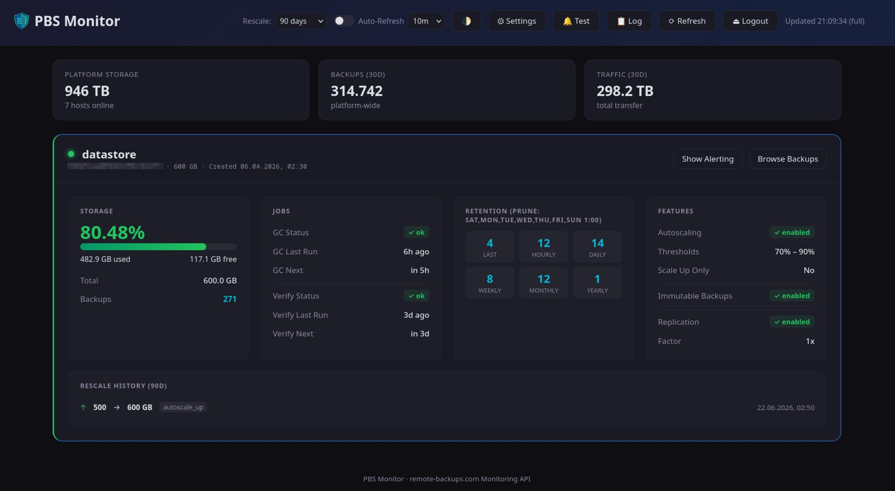

> [!TIP]  
> **🐳 Docker deployment:** Docker support is available and has been tested on my system.
> 
> **Quick start:**
> ```bash
> # Option 1: One-command deployment
> wget -qO quick-deploy.sh https://raw.githubusercontent.com/maschkef/PBS_monitor/main/docker/quick-deploy.sh && bash quick-deploy.sh
> 
> # Option 2: Traditional docker-compose workflow
> mkdir pbs-monitor && cd pbs-monitor
> wget https://raw.githubusercontent.com/maschkef/PBS_monitor/main/docker-compose.yml
> wget https://raw.githubusercontent.com/maschkef/PBS_monitor/main/.env.example -O .env
> nano .env  # Edit and set your API_KEY
> docker compose up -d
> 
> # Access the Web UI at http://localhost:5111
> ```
> 
> See release assets for documentation: [Latest Release](https://github.com/maschkef/PBS_monitor/releases/latest)

> [!NOTE]
> This project is not affiliated with, maintained, or endorsed by remote-backups.com.

---

## Prerequisites

**For Docker deployment (recommended):**
- Docker and Docker Compose

**For manual installation:**
- Python 3.9+

**General:**
- A remote-backups.com account with at least one datastore
- A Monitoring API token (generate at [Dashboard → Settings → Security](https://dashboard.remote-backups.com/settings/security))

## Setup

```bash
git clone https://github.com/maschkef/PBS_monitor
cd PBS_monitor

# Configure API key
cp .env.example .env
nano .env  # Edit and set your API_KEY

# Create and activate a virtual environment
python3 -m venv .venv
source .venv/bin/activate
pip install -r webui/requirements.txt -r alerting/requirements.txt
```

---

## Tool 1: Web UI

A graphical dashboard to check the status of all datastores at a glance.

### Start

```bash
# From the repository root, with the virtual environment activated
python -m webui.app
```

Open the dashboard: [http://127.0.0.1:5111](http://127.0.0.1:5111)

> **Production note:** By default the app is served by [Waitress](https://docs.pylonsproject.org/projects/waitress/) (included in `requirements.txt`), which avoids the Flask development-server warning. Set `FLASK_DEBUG=1` in `.env` to switch back to the Flask dev server with auto-reload.

<details>
<summary><strong>Features</strong></summary>

- **Storage gauge** with color coding (green < 80% < yellow < 90% < red)
- **GC & verification status** as badges with timestamps (last run, next scheduled)
- **Retention policy** — overview of prune configuration (keep last/hourly/daily/weekly/monthly/yearly)
- **Autoscaling configuration** — thresholds and mode
- **Light / Dark Mode** — automatically adapts to your system theme, with a manual toggle (🌓) available in the header
- **Immutable backup & replication status**
- **Backup browser** — explore PBS namespaces, backup groups, individual snapshots, and other protocols (rsync, sftp, zfs-recv) directly in the UI; each snapshot shows its verification status (verified / verify failed / unverified)

  <details>
  <summary>Show screenshots</summary>

  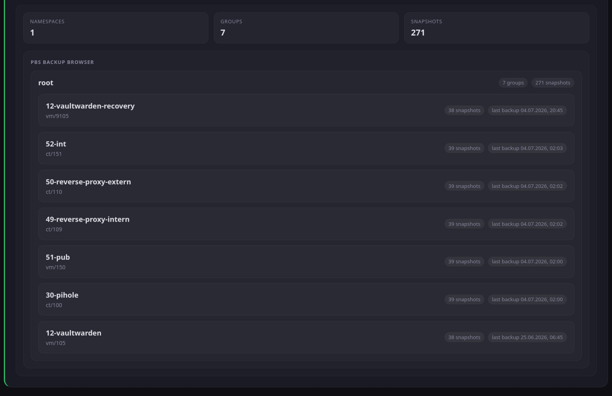
  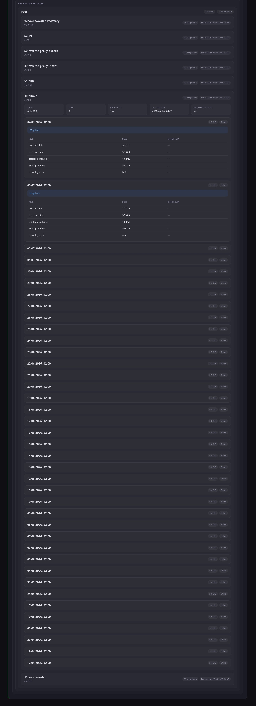

  </details>

- **Alerting configuration** — when the alerting component is active, the Web UI provides a complete interface to configure all alerting settings: schedules, thresholds, ignored groups, ntfy settings, quiet hours, notification priorities, and more
- **Editable group schedules** — learned schedules can be reviewed, edited, and locked from the Web UI; interval schedules support an optional anchor start time (e.g. `06:00` → backups expected at 06:00, 08:00, 10:00 …)
- **Next backup indicator** — each backup group in the alerting panel shows the calculated next expected backup time based on the active schedule
- **Ignored groups** — mute alerts for specific backup groups directly via the web interface; ignored groups are shown in a collapsible list and can be re-activated (Unignore) at any time
- **Rescale history** — timeline of the last 90 days (autoscaling events, manual resizes)
- **Notification log** — persistent history of all sent alerts (and test notifications); view, clear, or delete individual rows via the **📋 Log** button in the header
- **About tab** — shows current running version and environment (Docker/Native), with a manual GitHub release update check
- **Visual alerting** — current alert conditions and learned backup windows directly in the dashboard
- **Platform stats** — total storage, backup count and traffic across the platform
- **Two-tier refresh** — the **⟳ Refresh** button performs a full reload (all data including rescale-log, backup inventory, and platform stats); the **Auto-Refresh** timer runs a lightweight update that only fetches frequently-changing data (storage metrics, GC/verification timestamps, replication sync times, alerting state). This reduces API calls during auto-refresh from ~22+ to ~4 for a typical three-datastore account. Hover over each button or control for a tooltip describing what is and isn't refreshed.
- **Auto-Refresh** toggle with configurable intervals from 5 to 30 minutes, defaulting to 10 minutes
- **Health assessment** per datastore (healthy / warning / critical)

</details>

<details>
<summary><strong>Authentication</strong></summary>

The Web UI is open by default. To protect it with a password, set `WEBUI_PASSWORD` in `.env`:

```ini
WEBUI_PASSWORD=your-secure-password
# Optional, for stable sessions across restarts:
# Enter any long random text. If left empty, a key is generated automatically at startup (sessions are lost on restart).
WEBUI_SECRET_KEY=
```

When `WEBUI_PASSWORD` is set, the dashboard redirects unauthenticated visitors to a login page. Leave it empty if authentication is handled at the network edge (e.g. Traefik + OAuth2 proxy).

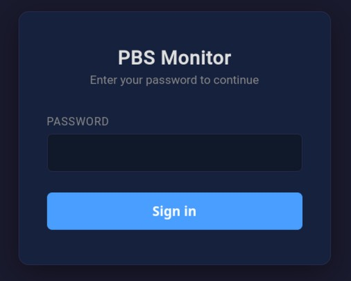

</details>

<details>
<summary><strong>Environment Variables</strong></summary>

The following variables can be set in `.env`:

| Variable | Default | Description |
|----------|---------|-------------|
| `WEBUI_PASSWORD` | *(empty)* | Dashboard password. Leave empty to disable authentication |
| `WEBUI_SECRET_KEY` | *(auto-generated)* | Flask session signing key. Auto-generated at startup if unset (sessions invalidated on restart) |
| `WEBUI_PORT` | `5111` | Port the web server listens on |
| `WEBUI_HOST` | `127.0.0.1` | Bind address. Set to `0.0.0.0` to expose on all interfaces |
| `WEBUI_READ_ONLY` | `0` | Set to `1` to disable all write operations (config edits, rule changes, ignore-group, live test) |
| `FLASK_DEBUG` | `0` | Set to `1` to enable Flask debug mode. Do **not** use in production |
| `WEBUI_SECURE_COOKIES` | `0` | Set to `1` to add the `Secure` flag to session cookies. Enable when the dashboard is served over HTTPS (e.g., behind a TLS-terminating reverse proxy) |
| `WEBUI_HIDE_SERVER_PATHS` | `0` | Set to `1` to omit server-side file system paths from the `/api/webui/info` endpoint (alerting data directory, Python executable). Recommended when the dashboard is publicly reachable |
| `WEBUI_PROXY_COUNT` | `0` | Number of trusted reverse proxy hops in front of Flask. When non-zero, Flask reads the real client IP from `X-Real-IP` (set by Traefik by default) or from `X-Forwarded-For`. Set to the number of proxies you control, e.g. `1` for a single Traefik, `2` for nginx → Traefik → Flask |
| `WEBUI_CSP` | *(built-in policy)* | Optional override for the `Content-Security-Policy` response header. Only set this when a reverse proxy or embedding setup requires a custom policy |

> [!TIP]
> **Reverse proxy setup:** Set `WEBUI_PROXY_COUNT` to the number of proxy hops you control. When set, Flask first checks `X-Real-IP` (which Traefik sets directly to the client IP) and falls back to `X-Forwarded-For`. This ensures rate-limiting and login audit logs always show the real client IP. Also enable `WEBUI_SECURE_COOKIES=1` when TLS is terminated by the proxy (e.g. Traefik).

</details>

<details>
<summary><strong>Dashboard Sections</strong></summary>

Each datastore is displayed as a card with four sections:

| Section | Content |
|---------|---------|
| **Storage** | Usage in %, used/free in GB, backup count |
| **Jobs** | GC status and verification status with timestamps |
| **Retention** | Prune schedule and keep values overview |
| **Features** | Autoscaling, immutable backups, replication |

</details>

---

## Tool 2: Alerting

A monitoring script that periodically checks datastore health and sends push notifications via [ntfy](https://ntfy.sh) when problems are detected.

This script is intentionally independent of the Web UI so it can run on its own
on a server via cron.

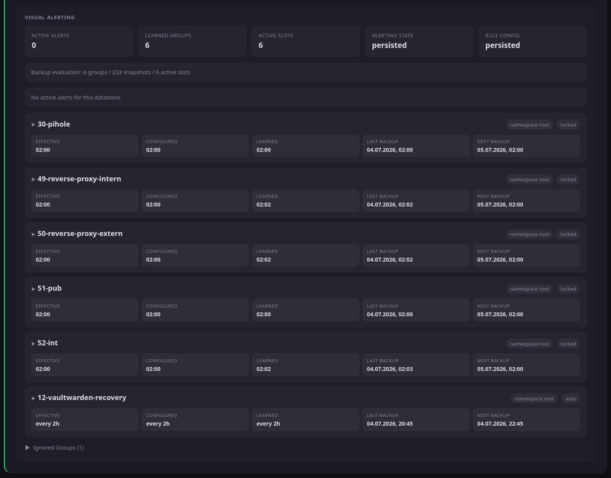

### Setup

If you start the dashboard or the alerting script without a configuration file, a default configuration will be created automatically, which you can then edit in the Web UI or directly in the file.

### Usage

```bash
# Single check
python -m alerting.monitor

# Daemon mode (uses daemon_interval_seconds from config)
python -m alerting.monitor --daemon

# Daemon mode with an explicit override (every 30 minutes)
python -m alerting.monitor --daemon 1800
```

<details>
<summary><strong>Features</strong></summary>

- **Storage monitoring** — warning at 80%, critical at 90%
- **GC monitoring** — alert on failure or when overdue (> 36h)
- **Verification monitoring** — alert on failure or overdue (> 14 days)
- **Backup inventory tracking** — collects namespace- and group-level PBS snapshot history for later learned alerting
- **Total loss detection** — immediate alarm when both backup browser and aggregate metrics drop to zero
- **Snapshot disappearance detection** — warns when the number of snapshots for a group drops below what the configured `keep_last` prune policy permits, indicating an unexpected deletion outside of normal pruning
- **Learned backup windows** — derives conservative weekday/time slots per backup group from observed snapshots
- **Missed backup alerts** — warns when a learned backup window is missed while off-schedule manual runs are treated as outliers
- **Locked group rules** — manual schedules can override learning for specific backup groups; interval schedules accept an optional anchor time (HH:MM) so the expected cadence is aligned to a fixed start instead of the last observed backup
- **Ignored groups** — specific backup groups can be completely excluded from monitoring via UI or configuration files; can be re-enabled from the Web UI at any time
- **Replication lag alerts** — warns when configured replication falls noticeably behind
- **Host offline detection** — alert when the server is unreachable
- **Immutable backup warning** — alert on pending disable request
- **API health check** — verifies platform availability
- **Quiet hours** — suppress low-priority alerts at night
- **Configurable notification priorities** — set ntfy priority per severity tier (warning / critical) and optionally override it for each individual alert type (e.g. silence "GC Never Ran" independently of other warnings, or set an alert type to `ignore` to suppress it entirely); the same 1–5 scale is used by the Quiet Hours minimum threshold
- **Alert cooldown** — prevents spam for persistent issues
- **Persistent state** — versioned per-group snapshot history retained across runs
- **Notification history log** — every dispatched alert (including test notifications sent from the Web UI) is appended to `notification_log.json`; viewable and clearable from the Web UI 📋 Log panel

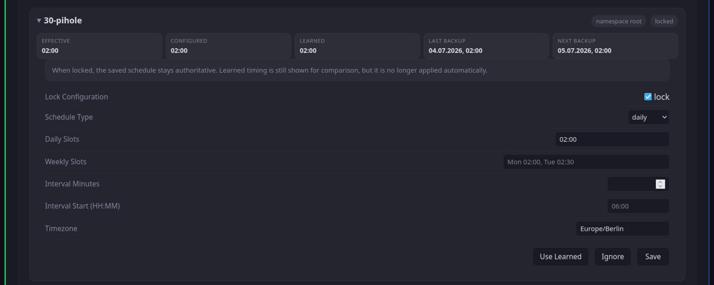

</details>

<details>
<summary><strong>Configuration (Web UI or manual)</strong></summary>

**Option 1: Via Web UI (recommended when using both tools)**

If you're running the Web UI tool (see above), you can configure all alerting settings through the web interface:

1. Start the Web UI from the repository root: `python -m webui.app`
2. Open [http://127.0.0.1:5111](http://127.0.0.1:5111)
3. Click the gear icon (⚙️) to open **Alerting Configuration**
4. Configure push notifications:
   - **ntfy Topic**: Enter your topic name (e.g., "my-pbs-alerts") to enable notifications
   - **ntfy URL**: Usually `https://ntfy.sh` (default)
   - **ntfy Token**: Optional, for private ntfy instances

5. Set alert priorities under **Notifications → Alert Priorities**: the **Warning** and **Critical** tier selectors set the default priority for each severity level. Expand **Per-Alert Priority Overrides** to set an individual priority for specific alert types (e.g. make "All Backups Gone" always urgent, silence "GC Never Ran", or set a type to `ignore` to suppress it completely). The same 1–5 scale applies to **Quiet Hours → Minimum priority to send**.

   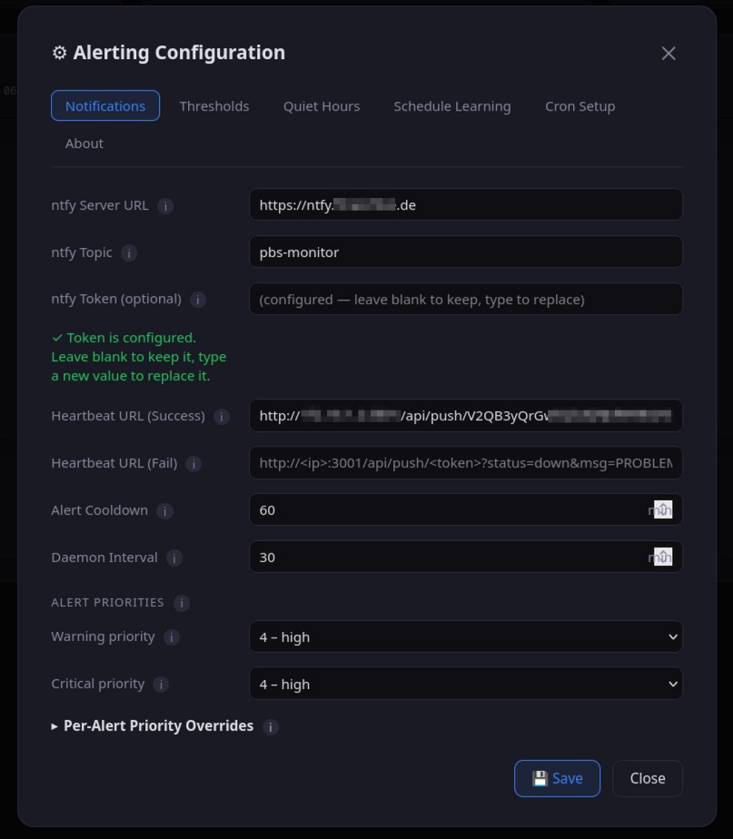

6. Adjust other settings as needed (thresholds, quiet hours, schedule learning, daemon interval, etc.)

   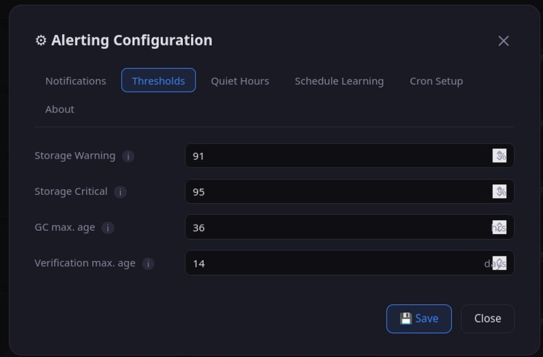
   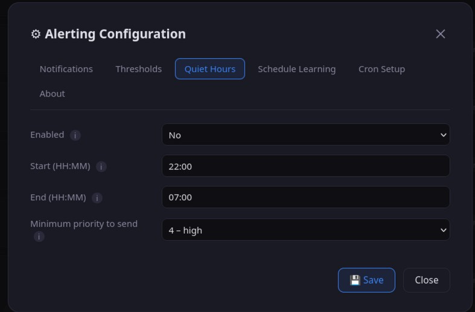
   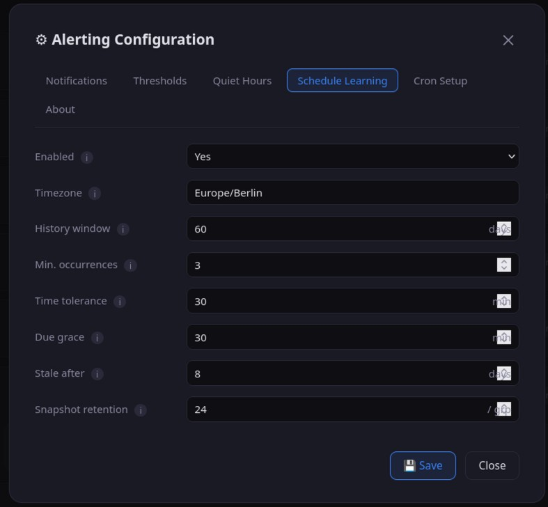

7. Save settings

**Option 2: Manual configuration file editing**

Alternatively, edit `alerting/config.json` directly. See the **Configuration File Reference** dropdown below for all available parameters:

```bash
# Edit alerting/config.json and set at minimum ntfy_topic if you want push notifications
# Set the Monitoring API token separately via API_KEY in the environment or .env
```

</details>

<details>
<summary><strong>Deployment (Cron / Systemd)</strong></summary>

**Cron Job (recommended)**

```bash
# Check every 30 minutes
*/30 * * * * cd /path/to/PBS_monitor && /path/to/PBS_monitor/.venv/bin/python -m alerting.monitor >> /var/log/pbs-monitor.log 2>&1
```

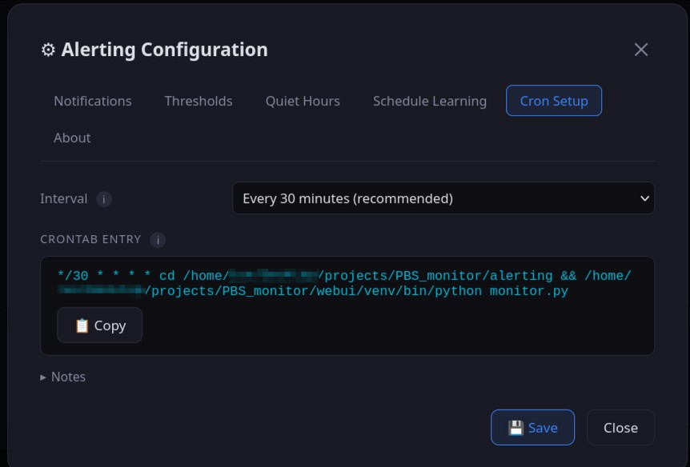
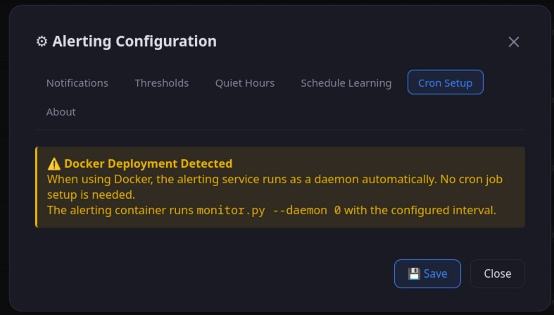

**Systemd Service (Alternative for background mode)**

For continuous operation on Linux systems without Docker, a `systemd` service running in daemon mode can be used instead of Cron. Create a file at `/etc/systemd/system/pbs-monitor-alerting.service`:

```ini
[Unit]
Description=PBS Monitor Alerting Daemon
After=network.target

[Service]
Type=simple
User=YOUR_USER
WorkingDirectory=/path/to/PBS_monitor
ExecStart=/path/to/PBS_monitor/.venv/bin/python -m alerting.monitor --daemon
Restart=on-failure
RestartSec=10

[Install]
WantedBy=multi-user.target
```

Then activate it using `sudo systemctl daemon-reload && sudo systemctl enable --now pbs-monitor-alerting.service`.

</details>

<details>
<summary><strong>Configuration File Reference</strong></summary>

When using manual configuration (Option 2 above), the file `alerting/config.json` will be automatically copied from `alerting/config.json.example` on the first run if you don't create it manually:

```json
{
  "_comment_api": "Base URL of the Monitoring API",
  "api_base": "https://api.remote-backups.com",
  
  "_comment_ntfy": "Push notification settings. Configure ntfy_topic to enable external notifications. Leave empty to disable.",
  "ntfy_url": "https://ntfy.sh",
  "ntfy_topic": "",
  "ntfy_token": "",

  "_comment_heartbeat": "Optional HTTP(S) GET ping URLs. heartbeat_url is pinged when no alerts are detected (success). heartbeat_fail_url is pinged when alerts are detected. If only heartbeat_url is set, no ping is sent when alerts exist — the timeout itself signals the problem.",
  "heartbeat_url": "",
  "heartbeat_fail_url": "",
  
  "_comment_ignored": "List of objects describing backup groups to ignore.",
  "ignored_groups": [],
  
  "_comment_thresholds": "Warning and critical thresholds for datastore events.",
  "thresholds": {
    "storage_warn_percent": 80,
    "storage_crit_percent": 90,
    "gc_max_age_hours": 36,
    "verification_max_age_days": 14
  },
  
  "_comment_quiet_hours": "Suppresses lower-priority alerts during specified hours.",
  "quiet_hours": {
    "enabled": false,
    "start": "22:00",
    "end": "07:00",
    "min_priority": 4
  },
  
  "_comment_priorities": "ntfy priority for outgoing alerts. Range 1–5 (5=urgent, bypasses DND). 'warning' and 'critical' are tier defaults applied by severity. 'per_alert' overrides individual alert types — set to 1-5 to force a priority, set to 'ignore' to suppress, or omit/set null to fall back to the tier default.",
  "notification_priorities": {
    "warning": 4,
    "critical": 5,
    "per_alert": {}
  },
  
  "_comment_learning": "Toggles dynamic learning for missed backup window detection.",
  "schedule_learning": {
    "enabled": true,
    "timezone": "local",
    "history_window_days": 60,
    "min_occurrences": 2,
    "time_tolerance_minutes": 30,
    "due_grace_minutes": 30,
    "stale_after_days": 8,
    "snapshot_retention_count": 24
  },
  
  "_comment_cooldown": "Minimum minutes to wait before repeating an alert of the same type.",
  "alert_cooldown_minutes": 60,
  
  "_comment_daemon": "Interval for daemon mode checks in seconds.",
  "daemon_interval_seconds": 1800
}
```

Per-group manual and locked schedules are stored separately in `alerting/group_rules.json`.
Supported manual schedule types are `daily`, `weekly`, and `interval`.

> [!TIP]
> **Easy configuration**: All parameters below can be configured through the Web UI interface (⚙️ Alerting Configuration) when both tools are running, instead of manually editing JSON files.

| Parameter | Description |
|-----------|-------------|
| `ntfy_topic` | **Configure to enable push notifications** (e.g., "your-alerts"). Leave empty to disable external notifications. Both `ntfy_topic` and `ntfy_url` must be set for notifications to be active |
| `ntfy_token` | Optional. Bearer token for private ntfy instances |
| `ntfy_url` | ntfy server URL (default: `https://ntfy.sh`). Must be set together with `ntfy_topic` for push notifications to work |
| `heartbeat_url` | Optional HTTP(S) GET ping URL called when **no alerts are detected** (success ping). If only this field is set and alerts exist, no ping is sent — the resulting timeout signals the problem to the monitoring tool. Also skipped when ntfy delivery fails (timeout still signals the problem). If the ping itself fails, an urgent alert is sent via ntfy. **Uptime Kuma (Push monitor):** use the URL shown in the monitor with `?status=up&msg=OK&ping=` |
| `heartbeat_fail_url` | Optional HTTP(S) GET ping URL called when **alerts are detected** (fail ping). Also pinged when ntfy delivery fails — so an external monitor receives an active failure signal even when push delivery is broken. Can be combined with `heartbeat_url` for explicit success/fail signalling. **Uptime Kuma:** same URL and token as `heartbeat_url`, but with `?status=down&msg=PROBLEM&ping=` |
| `ignored_groups` | List of backup groups (datastore, namespace, type, id) to exclude from alert generation |
| `storage_warn_percent` | Storage warning threshold in percent |
| `storage_crit_percent` | Storage critical threshold in percent |
| `gc_max_age_hours` | GC considered overdue after X hours |
| `verification_max_age_days` | Verification considered overdue after X days |
| `notification_priorities.warning` | ntfy priority for warning-tier alerts (default: `4` = high). Applies to: GC failed/overdue/never ran, host offline, missed backup, storage warning, replication stale, immutable disable pending, snapshots unexpectedly removed |
| `notification_priorities.critical` | ntfy priority for critical-tier alerts (default: `5` = urgent). Applies to: storage critical, verification failed, all backups gone, API unreachable, heartbeat failed |
| `notification_priorities.per_alert` | Optional object to override priority for individual alert types. Keys match the alert type (e.g. `"gc_failed"`, `"verification_overdue"`, `"all_backups_gone"`). Set a value (`1`-`5`) to override, `"ignore"` to suppress that alert type, or omit/`null` to fall back to the tier default. Configurable via **Per-Alert Priority Overrides** in the Web UI |
| `quiet_hours.enabled` | Enable quiet hours (true/false) |
| `quiet_hours.min_priority` | Only send alerts at or above this priority during quiet hours |
| `schedule_learning.enabled` | Enable learned backup-window detection |
| `schedule_learning.timezone` | Timezone used for schedule learning. Use `local` or an IANA timezone such as `Europe/Berlin` |
| `schedule_learning.history_window_days` | How many days of observed snapshot history are considered for learning |
| `schedule_learning.min_occurrences` | Required matching observations per weekday/time slot before it becomes active |
| `schedule_learning.time_tolerance_minutes` | Allowed schedule deviation in minutes for learning and slot matching. Default: `30` |
| `schedule_learning.due_grace_minutes` | How long a learned backup window may be late before a missed-backup alert is emitted. Default: `30` |
| `schedule_learning.stale_after_days` | Extra days beyond the normal weekly slot cadence before a learned slot is treated as stale |
| `schedule_learning.snapshot_retention_count` | How many recent snapshots per backup group are stored in state (default: 24). Used for schedule learning and snapshot-loss detection — raise this for groups with many daily backups |
| `alert_cooldown_minutes` | Minimum minutes between repeated alerts of the same type |
| `daemon_interval_seconds` | How often the daemon checks for issues when running in daemon mode (`--daemon`, `--daemon 0`, or Docker container, seconds, default: 1800). A positive CLI value such as `--daemon 600` overrides this setting. Configurable via the Web UI Settings panel under **Daemon Interval (minutes)** — the UI converts automatically. |

The following can also be set as environment variables (in `.env` or the shell):

| Environment Variable | Description |
|---------------------|-------------|
| `API_KEY` | Monitoring API token for remote-backups.com. Required by both tools. |
| `ALERTING_DATA_DIR` | Override the directory where `config.json`, `state.json`, and `group_rules.json` are stored. Defaults to the `alerting/` script directory. Can be set in `.env` or the shell. Set automatically in Docker containers (`/app/data`). |
| `NTFY_TOKEN` | Override the `ntfy_token` stored in `config.json`. Prefer this over storing the token on disk (e.g. `NTFY_TOKEN=tk_yoursecrettoken`). |

</details>

<details>
<summary><strong>Alert Priorities (ntfy)</strong></summary>

Each alert type has a **base priority** that determines which severity tier it falls into. The tier priority is then applied according to `notification_priorities.warning` / `.critical` (defaults: 4 = high, 5 = urgent). Individual alert types can be overridden independently via `notification_priorities.per_alert` or through **Per-Alert Priority Overrides** in the Web UI settings.

| Base | Tier | Alert types |
|------|------|-------------|
| 5 → critical | default: 5 (urgent) | Storage ≥ crit%, verification failed, all backups gone, API unreachable, heartbeat failed |
| 4 → warning | default: 4 (high) | GC failed, host offline, missed backup window/interval, replication stale/never synced, immutable disable pending, snapshots unexpectedly removed |
| 3 (no tier mapping) | stays at 3 (default) | Storage ≥ warn%, GC overdue/never ran, verification overdue/never ran |

> **Per-alert overrides** (e.g. `"gc_never_ran": 2`) take precedence over both the base priority and the tier defaults. Set a key to `"ignore"` to suppress that alert type entirely, or set it to `null` / omit it to fall back to the tier behaviour.

**Valid per-alert keys:** `gc_failed`, `gc_never_ran`, `gc_overdue`, `verification_failed`, `verification_never_ran`, `verification_overdue`, `storage_warning`, `storage_critical`, `all_backups_gone`, `snapshots_unexpectedly_removed`, `missed_backup_window`, `missed_backup_interval`, `host_offline`, `api_unreachable`, `api_unhealthy`, `monitoring_api_error`, `heartbeat_failed`, `ntfy_delivery_failed`, `immutable_disable_pending`, `replication_never_synced`, `replication_stale`

</details>

---

## Advanced / Reference

<details>
<summary><strong>API Limitations</strong></summary>

The Monitoring API is read-only. It now exposes live PBS namespaces, backup groups, and snapshots, but the following is still **not** available through this API:

- Whether a snapshot came from an automatic or manual run
- Configured backup schedules or frequencies per group
- I/O graphs or long-term time-series data

Per-snapshot verification status is displayed in the Web UI when the backup
inventory payload contains it, but the alerting script still evaluates
datastore-level verification status and learned backup windows rather than
treating per-snapshot verification as a scheduling signal.

The alerting script now persists backup-browser inventory per namespace and group and learns conservative weekday/time slots or short intervals from that history. Current backup alerting can detect:
- ✅ Whether all visible PBS backups have disappeared
- ✅ Whether a snapshot count drops below what the `keep_last` prune policy permits (unexpected deletion)
- ✅ Whether a learned recurring backup window was missed for a specific backup group
- ✅ Frequent recurring backups such as every 2 hours via interval detection — with optional fixed anchor time for aligned slot detection (e.g. `06:00` + every 2 h → 06:00, 08:00, 10:00 …)
- ✅ Daily recurring backups as a dedicated editable schedule type
- ✅ Off-schedule same-day snapshots as context without treating them as proof that the learned window ran
- ❌ More complex cadences such as monthly, biweekly, or truly irregular schedules

</details>

<details>
<summary><strong>Endpoints Used</strong></summary>

| Endpoint | Auth | Description |
|----------|------|-------------|
| `GET /monitoring/v1/datastores` | Bearer | All datastores with live metrics |
| `GET /monitoring/v1/datastores/{id}` | Bearer | Details incl. prune, autoscaling, replication |
| `GET /monitoring/v1/datastores/{id}/backups` | Bearer | Namespace-aware PBS backup inventory |
| `GET /monitoring/v1/datastores/{id}/backups/rsync` | Bearer | rsync backup data (Web UI) |
| `GET /monitoring/v1/datastores/{id}/backups/sftp` | Bearer | SFTP backup data (Web UI) |
| `GET /monitoring/v1/datastores/{id}/backups/zfs-recv` | Bearer | ZFS-recv backup data (Web UI) |
| `GET /monitoring/v1/datastores/{id}/rescale-log` | Bearer | Resize history |
| `GET /health` | — | Platform health |
| `GET /public/total-storage` | — | Total platform storage |
| `GET /public/backups-30-days` | — | Platform backup count (30 days) |
| `GET /public/traffic-30-days` | — | Platform traffic (30 days) |

</details>

<details>
<summary><strong>Project Structure</strong></summary>

```
PBS_monitor/
├── .env.example                    # API key template
├── .gitignore
├── docker-compose.yml               # Docker Compose deployment
├── LICENSE
├── README.md                       # English documentation
├── README_DE.md                    # German documentation
├── .github/
│   └── workflows/
│       ├── ci.yml                  # CI: lint, tests, Docker smoke-test
│       └── docker-publish.yml      # CI/CD: build and publish Docker images
├── docker/                         # Docker deployment files
│   ├── quick-deploy.sh             # One-command deployment script
│   ├── alerting/
│   │   └── Dockerfile
│   └── webui/
│       └── Dockerfile
├── docs/                           # Technical module documentation
│   ├── architecture.md
│   ├── alerting_monitor.md
│   ├── alerting_normalization.md
│   ├── alerting_notification.md
│   ├── alerting_schedule.md
│   ├── webui_alerting_ui.md
│   ├── webui_app.md
│   └── webui_utils.md
├── screenshots/                    # UI screenshots used in this README
├── tests/                          # Automated test suite
│   ├── conftest.py
│   ├── test_auth.py
│   ├── test_config_save.py
│   ├── test_csrf.py
│   ├── test_input_validation.py
│   ├── test_secret_redaction.py
│   ├── test_security_headers.py
│   └── requirements.txt
├── webui/                          # Tool 1: Web Dashboard
│   ├── app.py                      # Flask server (routes, session handling)
│   ├── alerting_ui.py              # Alerting-related UI routes and helpers
│   ├── normalizers.py              # Input normalisation helpers
│   ├── validators.py               # Input validation and SSRF protection
│   ├── requirements.txt
│   ├── static/
│   │   └── js/
│   │       └── dashboard.js        # Dashboard JavaScript
│   └── templates/
│       ├── index.html              # Single-page dashboard
│       └── login.html              # Login page (used when WEBUI_PASSWORD is set)
└── alerting/                       # Tool 2: Monitoring + Alerting
    ├── monitor.py                  # Main monitoring script (entry point)
    ├── normalization.py            # Data normalisation helpers
    ├── notification.py             # ntfy notification dispatch
    ├── schedule.py                 # Schedule learning and missed-backup detection
    ├── requirements.txt
    ├── config.json.example         # Alerting configuration template
    ├── config.json                 # Local config (gitignored)
    ├── group_rules.json            # Local per-group rules (gitignored, auto-generated)
    ├── state.json                  # Runtime state (gitignored, auto-generated)
    └── notification_log.json       # Notification history (gitignored, auto-generated)
```

</details>

---

## Contact

If you have questions, suggestions, or encounter issues with this project, feel free to reach out:

📧 **Email:** [maschkef-git@pm.me](mailto:maschkef-git@pm.me)

---

## License

This project is licensed under the MIT License — see the [LICENSE](LICENSE) file for details.
